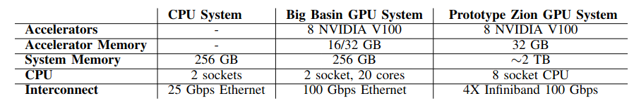
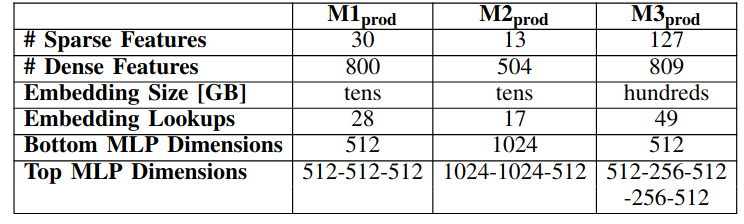
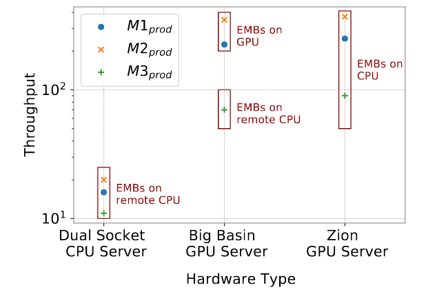
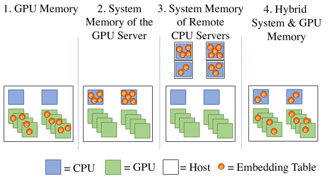

## CPU GPU Profiling for Training Recommendation Models

#### Hardware: 
 

#### Application properties: 
* Three models
*  

#### Summary:
* CPUs are considered for training due to large memory capacity and bandwidth requirement coming from large embedding tables (TBs in size). 
* Optimizing the placement of EMB(embedding tables) happens is the key to performance. 

#### Main motivation for Heterogeneous Opportunity: 
*  
	* Right placement of EMB in various hardware: (showing optimal placement strategies)

*  
	* Various strategies of placement: 
