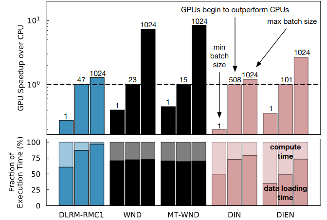
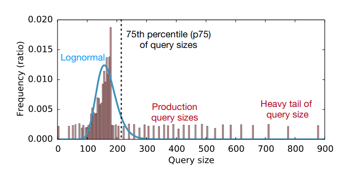
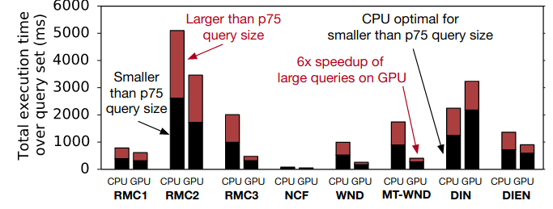
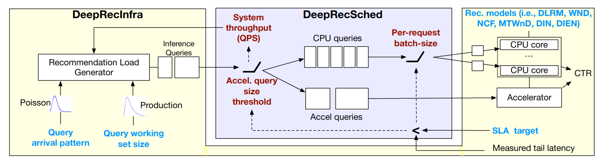

## Dynamic Scheduling for Recommendation System Inference Application

#### Hardware: 
* CPU1 - Xeon Class Skylake 40 cores, AVX 512
* CPU2 - Xeon Class Broadwell 28 cores, AVX256
* GPU - Nvidia GTX 1080Ti, 11GB VRAM

#### Summary: 
* Considering the inference query size and arrival patterns (server style), a dynamic scheduler uses CPU and GPU for speedup.
* Pick variety of RMs which have properties:  memory intensive, irregular memory accesses, and high storage. 

#### Main Motivation on Heterogeneous Opportunity: 

*  

	* For GPU run, sweeping over different batch sizes [1,1024] to compare GPU over CPU. It differs for each  RM. 
	* Bottom figure compares the compute and data transfer. 

*  
	* Deciding the threshold (TH) query size: if actual query size is lower than TH, execute on CPU else on GPU. 

*  
	* Deciding the benefit of one TH for heterogenity 
	* p75 query size is ~220. 
	* CPU performs better or similar to GPU for: RMC1, DIN, and DIEN. 
	
#### Main Design:
*   

#### Takeaways: 
*  For a fixed CPU, GPU configuration, the paper profiles various RMs/apps and shows the scope of CPU GPU. 
* The dynamic scheduler takes advantage of available CPU GPU based on model type, and query size. 
* It models a server style load generator. 

#### Issues: 
* How is GTX 1080 Ti a server class GPU? How does this GPU choice compare with multi-A100 adopted in MLPerf Inference benchmarked results? 
