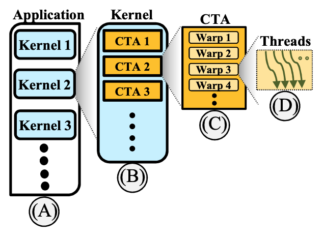
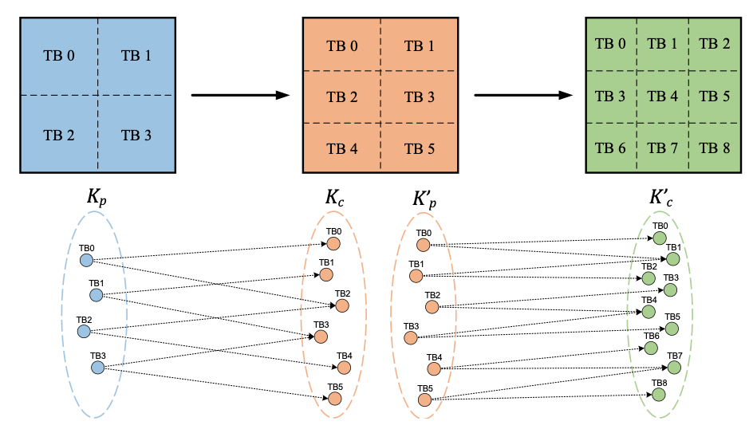
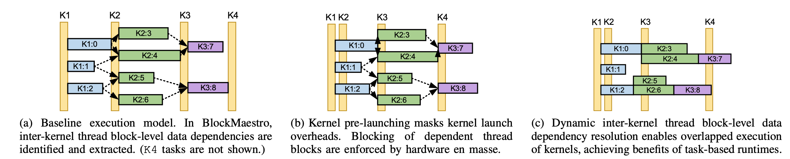
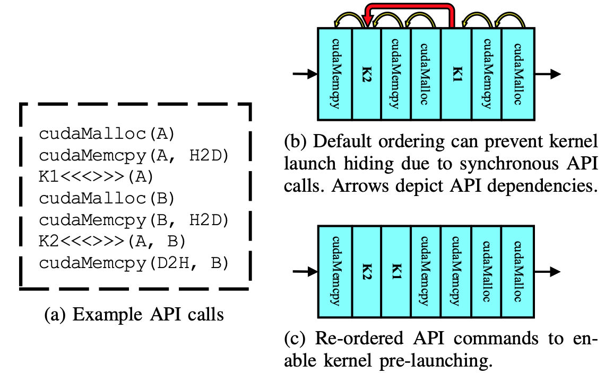
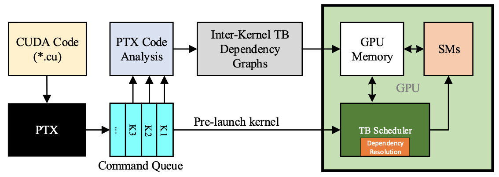

## Title: BlockMaestro - Enabling Programmer-Transparent Task-based Execution in GPU Systems
Link: https://hodjat.me/pubs/BlockMaestro_ISCA21.pdf

### Problem: 
- Applications like FFT, Gaussian, GramSchm, etc contains many kernels, and thus they incur heavy overheads of kernel launches. Also, there is issue of underutilization of GPU because of sync required to resolve the data-dependency between kernels. 
- Currently, the problem is solved using task based models but this requires lot of programmer effort. So, there is a need of an alternative way which doesn't require programmer invovlement. 

### Motivation and Key Ideas: 
- An application consists of many kernels. A GPU Kernel consists of many Threads Blocks(TB) or CTA(cooperative thread arrays). A TB consists of many warps, and a warp is a group of 32 threads. 
- TODO: data dependence pattern between kernels 
- TODO: various execution models to limit kernel launches via prelaunching 
- TODO: command queue reordering 
- TODO: block maestro high level design 

### Important takeaways:
- What does BlockMaestro literally mean? 
- Connecting the dots ... Similarlity of Prelaunching with Prefetching

